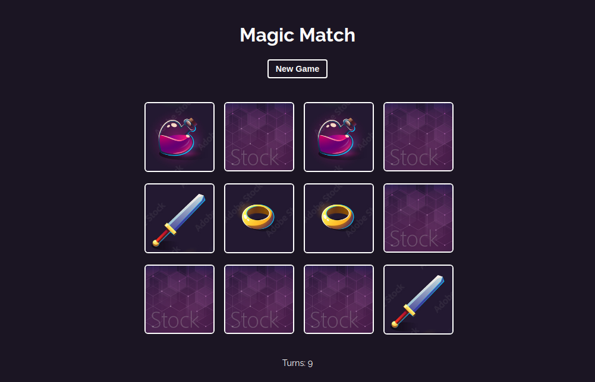

# Magic Memory




# **[Click to View](https://magic-memory-chi.vercel.app/)**

## Introduction

This repo is a simple memory game with reactjs
## Codebase

### Technologies

- **NextJs**: Front-end framework
<!---
- **StyledComponents**: CSS framework -->
- **Eslint**: Linter
- **Prettier** Code formatter

### Folder structure

```sh
src/
├── components     # Reusabble parts
```
<!---
├── layouts        # View templates
├── styles         # General app styles
└── pages          # Application views
-->

## Setup

1. Clone or download the project.
2. `cd` in the project directory.
3. Run `git remote rm origin` to remove the remote refenrece.
4. Run `yarn` to install dependencies
